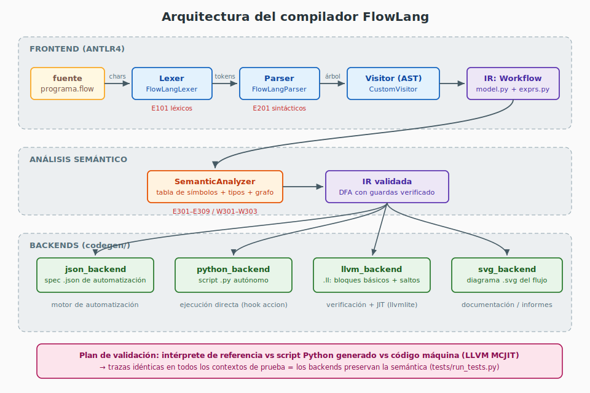
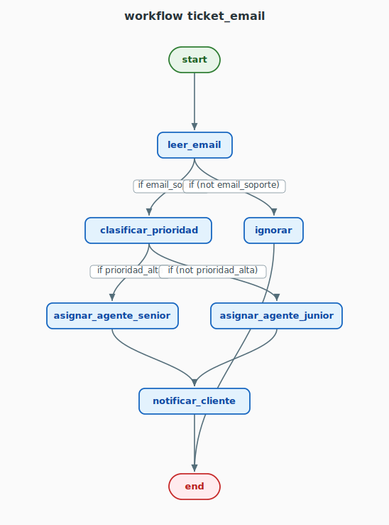
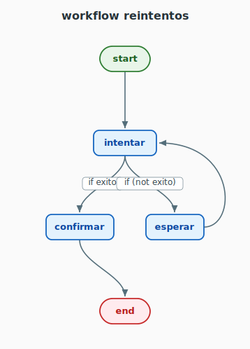

# FlowLang — Informe del Trabajo Final

**Curso:** Teoría de Compiladores (1ACC0218) — Sección 3230
**Proyecto:** FlowLang — DSL para Workflows de Automatización

| Código | Nombres y Apellidos |
| --- | --- |
| U202211490 | Jorge Rolando Garcia Roca |
| U202311021 | Sergio Andres Saavedra Cervera |
| U202310373 | Victor Manuel Carranza Lujan |
| U202423854 | Peter Smith Pacherres Muñoz |
| U202122405 | Piero Aldair Rivas Pinto |

---

## 1. Problemática y motivación

En entornos de automatización modernos, la definición de workflows implica herramientas como Apache Airflow, Prefect, n8n o GitHub Actions, que exigen conocimientos de Python, YAML o interfaces gráficas propietarias. Ninguna de ellas es un lenguaje de programación propiamente dicho diseñado para ser compilado: no existe una gramática formal que describa programas de workflow, ni un análisis semántico que verifique propiedades como la alcanzabilidad de estados o la existencia de un estado final.

FlowLang reduce la distancia entre la lógica de un workflow y su representación en código. Al contar con una gramática propia, es posible realizar **análisis estático en tiempo de compilación**: estados inalcanzables, ciclos sin salida, variables no declaradas e incompatibilidades de tipos se detectan antes de la ejecución. El dominio se modela como un **autómata finito determinista con guardas** (un grafo dirigido con condiciones booleanas), lo que permite aplicar directamente algoritmos de análisis de flujo de control, y su semántica acotada hace viable la generación de LLVM IR sin un runtime complejo.

## 2. Objetivos

**Objetivo general.** Diseñar e implementar FlowLang, un DSL para la definición de workflows de automatización, con frontend basado en ANTLR4 y backend de generación de código mediante LLVM IR.

**Objetivos específicos (todos cumplidos en este hito):**

1. Definir la gramática formal en ANTLR4: workflows, variables tipadas (`bool`, `int`, `string`), transiciones condicionales e incondicionales, y expresiones con `and`, `or`, `not` y `==`. ✔
2. Implementar el frontend completo: lexer, parser y construcción del AST con el patrón **Visitor**, con nodos tipados de expresión (`VariableExpr`, `LiteralExpr`, `EqualExpr`, `AndExpr`, `OrExpr`, `NotExpr`). ✔
3. Construir el **analizador semántico** con tabla de símbolos: estados declarados, alcanzabilidad, existencia de estado final y verificación de tipos en guardas. ✔
4. Generar **LLVM IR** desde el AST validado, representando el workflow como bloques básicos con saltos condicionales. ✔
5. Validar el compilador con una **suite de casos** que cubre programas válidos y errores léxicos, sintácticos y semánticos. ✔
6. *(Retroalimentación del profesor)* Desarrollar el Visitor de manera que genere el **script o JSON necesario para la automatización**, y añadir el **diagrama del flujo completo**. ✔ (backends JSON, script Python y SVG; §5).

## 3. Gramática en ANTLR4 (actualizada)

La gramática del Hito 1 se mantiene estable: cubrió correctamente todas las construcciones necesarias, y el trabajo del hito final se concentró en las fases posteriores del compilador. Las reglas del parser están en minúsculas y los tokens en mayúsculas; la regla `state` fue renombrada a `step` para evitar la colisión con el atributo interno `state` del parser generado por ANTLR para Python.

```antlr
grammar FlowLang;

root        : workflow+ EOF ;
workflow    : WORKFLOW ID LBRACE varDecl* transition+ RBRACE ;
transition  : step ARROW step (IF condition)? ;
step        : ID | START | END ;
condition   : expr ;

varDecl     : VAR ID COLON dataType ;
dataType    : BOOLTYPE | INTTYPE | STRINGTYPE ;

expr        : orExpr ;
orExpr      : andExpr (OR andExpr)* ;
andExpr     : notExpr (AND notExpr)* ;
notExpr     : NOT notExpr | comparison ;
comparison  : primary (EQ primary)? ;
primary     : ID | NUMBER | STRING | TRUE | FALSE | LPAREN expr RPAREN ;
```

La estratificación `orExpr → andExpr → notExpr → comparison → primary` codifica la **precedencia** de operadores en la propia estructura de la gramática, de modo que el árbol sintáctico ya refleja el orden de evaluación y el Visitor construye el AST con asociatividad izquierda sin lógica adicional.

## 4. Arquitectura del compilador



El pipeline completo es:

```
programa.flow ─lexer→ tokens ─parser→ árbol sintáctico ─Visitor→ IR (Workflow)
              ─análisis semántico→ IR validada ─backends→ .json | .py | .ll | .svg
```

| Módulo | Responsabilidad |
| --- | --- |
| `grammar/FlowLang.g4` | Gramática ANTLR4 (léxico + sintaxis) |
| `src/FlowLangLexer.py`, `src/FlowLangParser.py`, `src/FlowLangVisitor.py` | Código generado por ANTLR 4.9.3 |
| `src/FlowLangCustomVisitor.py` | **Patrón Visitor**: recorre el árbol y construye la IR |
| `src/model.py` | IR de alto nivel: `Workflow`, `Transition`, tabla de símbolos |
| `src/exprs.py` | AST tipado de expresiones + inferencia de tipos + serialización JSON |
| `src/errors.py` | Diagnósticos con fase/código/línea; *error listeners* que capturan E101/E201 |
| `src/semantic.py` | Analizador semántico (E301–E309, W301–W303) |
| `src/codegen/json_backend.py` | Especificación JSON para motores de automatización |
| `src/codegen/python_backend.py` | Script Python autónomo de automatización |
| `src/codegen/llvm_backend.py` | LLVM IR: bloques básicos + saltos condicionales |
| `src/codegen/svg_backend.py` | Diagrama SVG del grafo del workflow (layout por capas) |
| `src/interpreter.py` | Intérprete de referencia (semántica operacional del lenguaje) |
| `src/llvm_exec.py` | Ejecución JIT del IR con llvmlite/MCJIT (validación cruzada) |
| `src/flowc.py` | CLI que orquesta todo: `check`, `ast`, `json`, `script`, `llvm`, `svg`, `run`, `build` |

**Decisión clave: una sola IR, cuatro backends.** El Visitor produce una única representación intermedia validada (`model.Workflow` con árboles de expresión de `exprs.py`), y *todos* los backends la consumen. Esto garantiza que el JSON, el script, el IR de LLVM y el diagrama describen exactamente el mismo programa: no hay re-parsing ni representaciones divergentes.

### 4.1 Análisis semántico

Con la tabla de símbolos (nombre → tipo) y el grafo dirigido de estados se verifican las propiedades prometidas por el diseño del lenguaje:

| Código | Verificación | Técnica |
| --- | --- | --- |
| E301 / E302 | existe salida de `start` / llegada a `end` | inspección de aristas |
| E303 | variable duplicada | tabla de símbolos |
| E304 | variable usada sin declarar | `collect_vars` sobre el AST de la guardia |
| E305 | incompatibilidad de tipos (p. ej. `string == int`) | inferencia de tipos sobre el AST |
| E306 | guardia no booleana (p. ej. `if edad` con `edad:int`) | tipo raíz de la condición |
| E307 | estado inalcanzable desde `start` | DFS directo |
| E308 | estado sumidero (sin salidas, distinto de `end`) | grado de salida |
| E309 | ciclo sin salida (imposible alcanzar `end`) | DFS inverso desde `end` |
| W301–W303 | transición muerta, variable sin uso, salidas desde `end` | análisis de orden/uso |

### 4.2 Backends de automatización (retroalimentación del profesor)

**JSON.** Cada workflow se serializa a una especificación consumible por un motor de automatización. Las guardas **no se serializan como texto** sino como árboles de expresión estructurados, evaluables sin re-parsear:

```json
"validar": {
  "transitions": [
    { "target": "procesar_pago", "condition": { "op": "var", "name": "stock_ok" } },
    { "target": "cancelar", "condition": { "op": "not", "expr": { "op": "var", "name": "stock_ok" } } }
  ]
}
```

**Script Python.** `flowc script` genera un ejecutable **autónomo** (no requiere ANTLR ni el compilador) que embebe la especificación JSON, evalúa las guardas, recorre los estados y expone el hook `accion(estado, ctx)` como punto de extensión donde el equipo de automatización conecta las acciones reales (llamadas HTTP, correos, etc.). El contexto se recibe por CLI (`--set var=valor`) o interactivamente.

### 4.3 Backend LLVM

El esquema de traducción es el prometido: **cada estado es un bloque básico** y las guardas se compilan a **saltos condicionales** evaluados en orden de fuente. Las variables son parámetros de la función (`bool→i1`, `int→i32`, `string→ptr`); al entrar a cada bloque se invoca el hook externo `@flow_action(ptr)` (equivalente en IR del hook `accion` del script); `==` sobre enteros/booleanos es `icmp eq` y sobre strings una llamada al runtime `@flow_streq`; `and/or/not` son `and/or/xor` sobre `i1`. Si ninguna guardia aplica se salta a `%flow_stuck` (`ret i32 1`); `state_end` retorna `0`.

```llvm
define i32 @workflow_compra(i1 %stock_ok) {
entry:
  br label %state_start
state_start:
  call void @flow_action(ptr @.str.start.0)
  br label %state_validar
state_validar:
  call void @flow_action(ptr @.str.validar.1)
  br i1 %stock_ok, label %state_procesar_pago, label %guard_validar_1
guard_validar_1:
  %t1 = xor i1 %stock_ok, true
  br i1 %t1, label %state_cancelar, label %flow_stuck
...
state_end:
  call void @flow_action(ptr @.str.end.5)
  ret i32 0
flow_stuck:
  ret i32 1
}
```

El módulo generado se verifica con los *bindings* oficiales de LLVM (`llvmlite`) y, además, se **compila a código máquina y se ejecuta** con MCJIT durante la validación (§6).

### 4.4 Backend SVG (flujo completo)

`flowc svg` dibuja el grafo del workflow directamente desde la IR, sin dependencias externas, con un layout por capas estilo Sugiyama simplificado: cada estado recibe como capa la longitud del camino más largo desde `start` (ignorando aristas de retroceso detectadas por DFS), los nodos se ordenan por baricentro de sus predecesores para reducir cruces, y las guardas se rotulan sobre las aristas. Las imágenes de este informe (`docs/img/*.svg`) fueron generadas por el propio compilador.

**Ejemplo — flujo completo del workflow `ticket_email`:**



**Ejemplo con ciclo (arista de retroceso) — `reintentos`:**



## 5. Flujo final de uso del lenguaje

El flujo de punta a punta con FlowLang es:

1. El analista describe el proceso en un archivo `.flow` (o lo genera un LLM con decodificación restringida por la gramática GBNF, §7).
2. `flowc check` valida léxico, sintaxis y semántica; los errores se reportan con código, fase y línea.
3. `flowc build` genera los cuatro artefactos: la **especificación JSON** para el motor de automatización, el **script Python autónomo** listo para conectar acciones reales, el **módulo LLVM IR** verificable y compilable, y el **diagrama SVG** para documentación.
4. El script (o el motor que consume el JSON) ejecuta el workflow evaluando las guardas con el contexto real; el diagrama documenta el proceso ante el negocio.

```bash
python3 src/flowc.py build examples/compra.flow -d output/
# → output/compra.json  output/compra_run.py  output/compra.ll  output/compra.svg
python3 output/compra_run.py --set stock_ok=true
#   recorrido: start -> validar -> procesar_pago -> enviar_email -> end
```

## 6. Plan de validación y resultados

**Plan.** La suite `tests/run_tests.py` ejecuta dos fases:

* **Fase A (9 programas válidos):** (A1) compilación sin errores; (A2) el JSON es bien formado y consistente con la IR (mismos estados y transiciones); (A3) el módulo LLVM pasa el verificador de LLVM; (A4) **ejecución cruzada** — para cada combinación de valores de las variables (los booleanos con ambos valores; enteros y strings con los literales de las guardas más un valor distinto), la traza del **intérprete de referencia**, la del **script Python generado** (ejecutado en subproceso) y la del **código máquina JIT-compilado desde el LLVM IR** (MCJIT, con `@flow_action` registrado como callback que captura la traza) deben ser **idénticas**.
* **Fase B (14 programas inválidos):** cada archivo declara el diagnóstico esperado (`// EXPECT: Exxx`) y se comprueba que el compilador reporta exactamente ese código. Cubre 2 errores léxicos, 3 sintácticos y los 9 semánticos E301–E309.

**Resultados.**

| Fase | Casos | Verificaciones | Resultado |
| --- | --- | --- | --- |
| A — válidos | 9 programas | 36 (A1–A4; A4 compara 2–8 contextos × 3 backends por programa) | **36/36 PASS** |
| B — inválidos | 14 programas | 14 (código de error esperado) | **14/14 PASS** |
| **Total** | 23 | **50** | **50/50 PASS** |

La verificación A4 es la más fuerte: demuestra empíricamente que los tres caminos de ejecución (intérprete, script generado y código máquina LLVM) implementan **la misma semántica operacional**, que es el criterio de corrección de un backend de compilador.

## 7. Extensión: integración con Ollama

La gramática de FlowLang puede transcribirse a GBNF para usar *grammar-constrained decoding* en un modelo local vía Ollama, forzando que el LLM genere únicamente programas sintácticamente válidos a partir de lenguaje natural (Geng et al., 2023). GCD garantiza solo la corrección **sintáctica**; las propiedades semánticas (tipos, alcanzabilidad, existencia de `end`) siguen siendo responsabilidad del compilador aquí implementado, que se mantiene como fuente de verdad. La ejecución local se justifica por privacidad de los datos del negocio, ausencia de costo por token y control de la versión del modelo.

## 8. Conclusiones

* La correspondencia workflow ↔ DFA con guardas permitió que el analizador semántico verificara propiedades formales (alcanzabilidad, terminación, ausencia de trampas) con algoritmos de grafos estándar en tiempo de compilación — la intersección natural entre teoría de compiladores y teoría de autómatas que motivó el proyecto.
* Diseñar **una única IR** consumida por los cuatro backends eliminó divergencias de representación y habilitó la validación por ejecución cruzada: el mismo árbol de expresiones que verifica el analizador de tipos es el que se serializa a JSON, se evalúa en el script y se compila a `i1` en LLVM.
* La validación por **equivalencia de trazas** entre el intérprete de referencia y el código máquina JIT-compilado resultó ser el criterio de corrección más exigente y valioso del proyecto: detecta errores de generación de código que la mera verificación estructural del IR no puede ver.
* La retroalimentación del hito anterior (generar el script/JSON de automatización y el diagrama del flujo) se integró sin modificar la gramática ni el frontend, evidencia de que la separación frontend / IR / backends fue una decisión de arquitectura correcta.

## 9. Bibliografía

* Lattner, C., & Adve, V. (2004). LLVM: A compilation framework for lifelong program analysis & transformation. *CGO 2004*. https://llvm.org/pubs/2004-01-30-CGO-LLVM.pdf
* Parr, T. (2013). *The Definitive ANTLR 4 Reference* (2.ª ed.). Pragmatic Bookshelf.
* Russell, N., Ter Hofstede, A. H., van der Aalst, W. M., & Mulyar, N. (2006). *Workflow Control-Flow Patterns: A Revised View*. Queensland University of Technology.
* Van Der Aalst, W. M. (1998). The application of Petri nets to workflow management. *Journal of Circuits, Systems, and Computers*, 8(01), 21–66.
* Geng, S., et al. (2023). Grammar-constrained decoding for structured NLP tasks without finetuning. *EMNLP 2023*.
